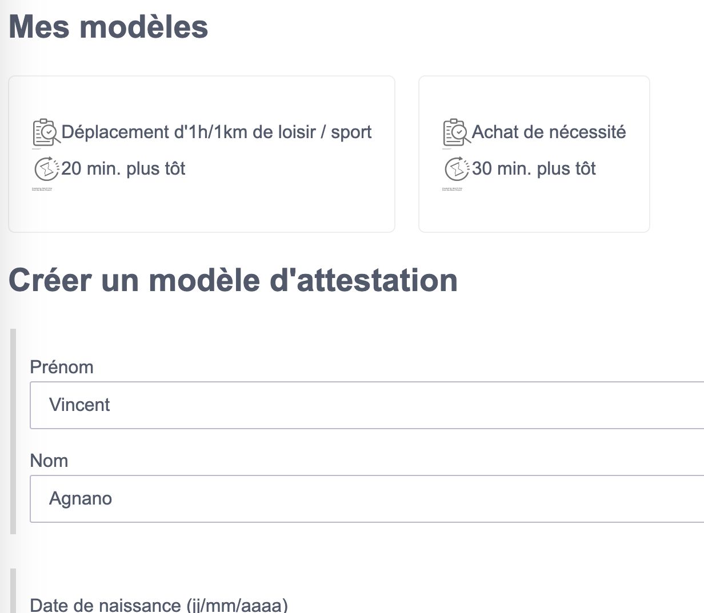

# Generateur d'attestations COVID-19 (confinement#2)

Ce projet s'appuie sur les dérogations délivrées par https://media.interieur.gouv.fr/deplacement-covid-19/.

Si vous allez chercher les enfants à l'école ou devez vous rendre au travail, si vous devez sortir pour des raisons de santé… il peut être contraignant et complexe de remplir une nouvelle attestion.

Cet outils, similaire à l'outils du gouvernement, permet en plus de mémoriser les attestations afin de vous assister dans votre quotidien.

https://attestation.connect.cafe

## Credit

 * Site officiel de l'application d'origine, sur laquelle s'appuie `certificate.js` : https://github.com/LAB-MI/deplacement-covid-19
 * _Fork_ de ce projet : https://github.com/GetLuko/Covid19-French-Auth
